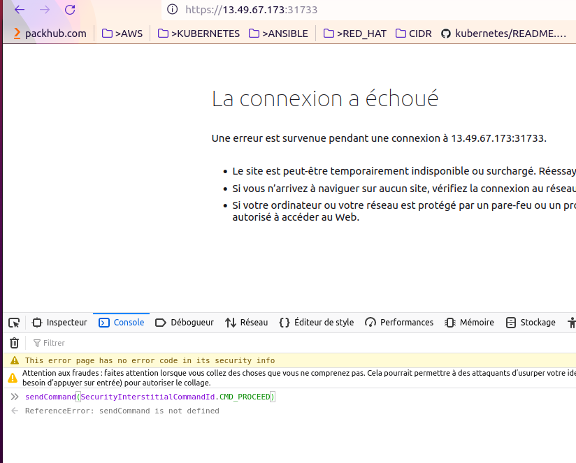
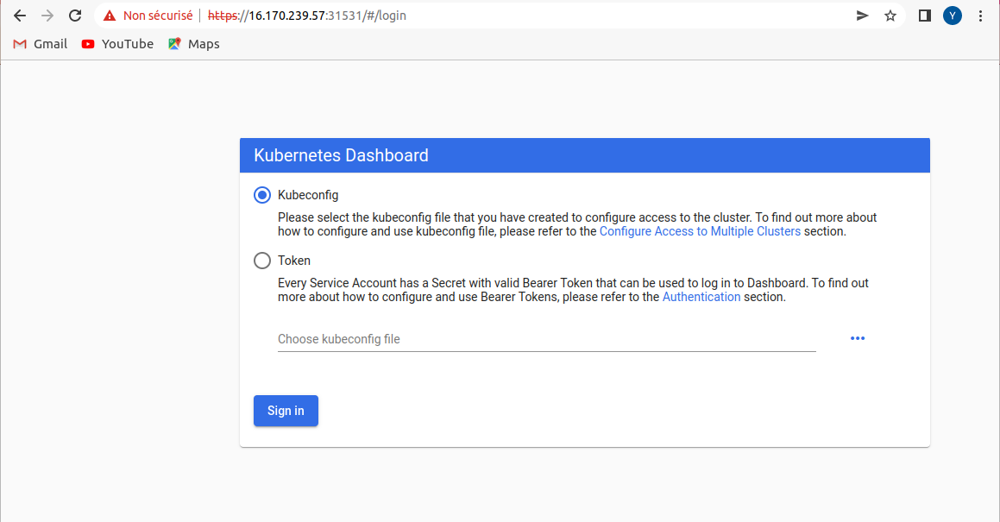

# PROJET KUBERNETES

## Ce projet est constitué de 5 parties. 
### La première partie concerne l'installation d'un cluster  kubeadm  et déploiement d'application
### La deuxième partie concerne la migration du cluster vers EKS
### La troisième partie concerne la surveillance avec Prometheus et Grafana
### La quatrième partie concerne le déploiement continu avec ARGOCD
### La cinquième partie concerne la securité avec KUBE-BENCH 

---
### Partie 1: Installation d'un cluster  kubeadm  et déploiement d'application

1. Déployer un cluster K8S et installer les microservices de demos
    * Dépliement d'un cluster kubernetes 1.19
    L'installation de kubeadm à été réaliser à l'aide de script depuis l'url suivant:  

    [SCRIPT=> Installation d'un cluster k8s](https://github.com/OusmanaTraore/kubernetes/tree/master/kubernetes_fundamental/Installation_kubernetes%20_V2) 
    
    * Déployez l’application de démos (Hello from nodejs)
    * Mise à jour de version de Kubernetes vers la version 1.21
        - elle se fait en deux étape:
        1. mise à jour depuis la version 1.19 vers la version 1.20
        2.  mise à jour depuis la version 1.20 vers la version 1.21  

        [SCRIPT=> Mise à jour de kubeadm](https://raw.githubusercontent.com/OusmanaTraore/all/master/PROJET/upgrade.sh) 

    * Configuration du dashboard de Kubernetes.

        ```
        kubectl create -f https://bit.ly/2OFQRMy
        kubectl get svc --all-namespaces
        kubectl -n kubernetes-dashboard edit svc kubernetes-dashboard

        # ....
        # selector:
        # k8s-app: kubernetes-dashboard
        # sessionAffinity: None
        # type: NodePort #<-- Edit this line
        # status:
        # loadBalancer: {}

        kubectl -n kubernetes-dashboard get svc kubernetes-dashboard
        kubectl create clusterrolebinding dashaccess --clusterrole=cluster-admin --serviceaccount=kubernetes-dashboard:kubernetes-dashboard
        kubectl -n kubernetes-dashboard describe secrets kubernetes-dashboard-token-<XXXX-XXXX>
        ``` 
        Accedez au dashboard depuis le navigateur internet puis inspecter le et entrer la commande suivante depuis la console  

          

        sendCommand(SecurityInterstitialCommandId.CMD_PROCEED)  
        
        puis recpuerez le token depuis votre console

        
        
---
### Partie 2: MIGRATION VERS EKS
2. Migration vers EKS
    ```
        ## MISE A JOUR DE EKS
        CLUSTERNAME="ousmana-project-eks2"
        eksctl upgrade cluster --name ${CLUSTERNAME} --approve

        eksctl upgrade nodegroup --name=ng-cb32905d --cluster=ousmana-project-eks2 --kubernetes-version=1.21

        ### Mise a jour CORE DNS
        eksctl get addon --name coredns --cluster ${CLUSTERNAME}
        eksctl utils update-coredns --cluster=${CLUSTERNAME} --approve
        kubectl describe deployment coredns --namespace kube-system | grep Image | cut -d "/" -f 3

        ### Mise a jour Kube-proxy
        eksctl utils update-kube-proxy --cluster=${CLUSTERNAME} --approve

        kubectl get daemonset kube-proxy --namespace kube-system -o=jsonpath='{$.spec.template.spec.containers[:1].image}'
        kubectl describe deployment coredns --namespace kube-system | grep Image | cut -d "/" -f 3
    ```
    Accéder à l'application escdemo en cliquant sur le lien suivant: 

     [ecsdemo](http://afe24b534f2d64968b42a919df88b4de-1401280157.eu-north-1.elb.amazonaws.com) 
---
### Partie 3: SURVEILLANCE 
3. Surveillance avec PROMETHEUS et GRAFANA  

Accéder au DASHBOARD GRAFANA en cliquant sur le lien suivant: 


   [ DASHBOARD GRAFANA ](http://a41e9573df81e4d348922da2455df2da-696240626.eu-north-1.elb.amazonaws.com/?orgId=1)


   [DASHBOARD GRAFANA KUBERNETES CLUSTER ](http://a41e9573df81e4d348922da2455df2da-696240626.eu-north-1.elb.amazonaws.com/d/IPrny1wnz/kubernetes-cluster-monitoring-via-prometheus?orgId=1&refresh=10s)


   [DASHBOARD GRAFANA KUBERNETES PODS  ](http://a41e9573df81e4d348922da2455df2da-696240626.eu-north-1.elb.amazonaws.com/d/4XuMd2Iiz/kubernetes-pod-monitoring?orgId=1)

---
### Partie 4: DEPLOIEMENT CONTINU
4. Déploiement continu avec ARGOCD  

Accéder au DASHBOARD ARGOCD en cliquant sur le lien suivant: 


   [ DASHBOARD ARGOCD ](https://a45c9719527624116a8ce4c4db40ad84-932098440.eu-north-1.elb.amazonaws.com/applications)

---
### Partie 5: BENCHMARK DE SECURITE
5. CIS EKS BENCHMARK ASSESSMENT USING KUBE-BENCH
```
    [INFO] 1 Control Plane Components

== Summary master ==
0 checks PASS
0 checks FAIL
0 checks WARN
0 checks INFO

[INFO] 2 Control Plane Configuration
[INFO] 2.1 Logging
[WARN] 2.1.1 Enable audit logs

== Remediations controlplane ==
2.1.1 audit test did not run: No tests defined

== Summary controlplane ==
0 checks PASS
0 checks FAIL
1 checks WARN
0 checks INFO

[INFO] 3 Worker Node Security Configuration
[INFO] 3.1 Worker Node Configuration Files
[FAIL] 3.1.1 Ensure that the proxy kubeconfig file permissions are set to 644 or more restrictive (Scored)
[FAIL] 3.1.2 Ensure that the proxy kubeconfig file ownership is set to root:root (Scored)
[PASS] 3.1.3 Ensure that the kubelet configuration file has permissions set to 644 or more restrictive (Scored)
[PASS] 3.1.4 Ensure that the kubelet configuration file ownership is set to root:root (Scored)
[INFO] 3.2 Kubelet
[PASS] 3.2.1 Ensure that the --anonymous-auth argument is set to false (Scored)
[PASS] 3.2.2 Ensure that the --authorization-mode argument is not set to AlwaysAllow (Scored)
[PASS] 3.2.3 Ensure that the --client-ca-file argument is set as appropriate (Scored)
[FAIL] 3.2.4 Ensure that the --read-only-port argument is set to 0 (Scored)
[PASS] 3.2.5 Ensure that the --streaming-connection-idle-timeout argument is not set to 0 (Scored)
[FAIL] 3.2.6 Ensure that the --protect-kernel-defaults argument is set to true (Scored)
[PASS] 3.2.7 Ensure that the --make-iptables-util-chains argument is set to true (Scored) 
[PASS] 3.2.8 Ensure that the --hostname-override argument is not set (Scored)
[WARN] 3.2.9 Ensure that the --event-qps argument is set to 0 or a level which ensures appropriate event capture (Scored)
[PASS] 3.2.10 Ensure that the --rotate-certificates argument is not set to false (Scored)
[FAIL] 3.2.11 Ensure that the RotateKubeletServerCertificate argument is set to true (Scored)

== Remediations node ==
3.1.1 Run the below command (based on the file location on your system) on each worker node.
For example,
chmod 644 /etc/kubernetes/proxy.conf

3.1.2 Run the below command (based on the file location on your system) on each worker node.
For example, chown root:root /etc/kubernetes/proxy.conf

3.2.4 If using a Kubelet config file, edit the file to set readOnlyPort to 0.
If using command line arguments, edit the kubelet service file
/etc/systemd/system/kubelet.service.d/10-kubeadm.conf on each worker node and
set the below parameter in KUBELET_SYSTEM_PODS_ARGS variable.
--read-only-port=0
Based on your system, restart the kubelet service. For example:
systemctl daemon-reload
systemctl restart kubelet.service

3.2.6 If using a Kubelet config file, edit the file to set protectKernelDefaults: true.
If using command line arguments, edit the kubelet service file
/etc/systemd/system/kubelet.service.d/10-kubeadm.conf on each worker node and
set the below parameter in KUBELET_SYSTEM_PODS_ARGS variable.
--protect-kernel-defaults=true
Based on your system, restart the kubelet service. For example:
systemctl daemon-reload
systemctl restart kubelet.service

3.2.9 If using a Kubelet config file, edit the file to set eventRecordQPS: to an appropriate level.
If using command line arguments, edit the kubelet service file
/etc/systemd/system/kubelet.service.d/10-kubeadm.conf on each worker node and
set the below parameter in KUBELET_SYSTEM_PODS_ARGS variable.
Based on your system, restart the kubelet service. For example:
systemctl daemon-reload
systemctl restart kubelet.service

3.2.11 Edit the kubelet service file /etc/systemd/system/kubelet.service.d/10-kubeadm.conf
on each worker node and set the below parameter in KUBELET_CERTIFICATE_ARGS variable.
--feature-gates=RotateKubeletServerCertificate=true
Based on your system, restart the kubelet service. For example:
systemctl daemon-reload
systemctl restart kubelet.service


== Summary node ==
9 checks PASS
5 checks FAIL
1 checks WARN
0 checks INFO

[INFO] 4 Policies
[INFO] 4.1 RBAC and Service Accounts
[WARN] 4.1.1 Ensure that the cluster-admin role is only used where required (Not Scored)
[WARN] 4.1.2 Minimize access to secrets (Not Scored)
[WARN] 4.1.3 Minimize wildcard use in Roles and ClusterRoles (Not Scored)
[WARN] 4.1.4 Minimize access to create pods (Not Scored)
[WARN] 4.1.5 Ensure that default service accounts are not actively used. (Not Scored)
[WARN] 4.1.6 Ensure that Service Account Tokens are only mounted where necessary (Not Scored)
[INFO] 4.2 Pod Security Policies
[WARN] 4.2.1 Minimize the admission of privileged containers (Not Scored)
[WARN] 4.2.2 Minimize the admission of containers wishing to share the host process ID namespace (Not Scored)
[WARN] 4.2.3 Minimize the admission of containers wishing to share the host IPC namespace (Not Scored)
[WARN] 4.2.4 Minimize the admission of containers wishing to share the host network namespace (Not Scored)
[WARN] 4.2.5 Minimize the admission of containers with allowPrivilegeEscalation (Not Scored)
[WARN] 4.2.6 Minimize the admission of root containers (Not Scored)
[WARN] 4.2.7 Minimize the admission of containers with the NET_RAW capability (Not Scored)
[WARN] 4.2.8 Minimize the admission of containers with added capabilities (Not Scored)
[WARN] 4.2.9 Minimize the admission of containers with capabilities assigned (Not Scored)
[INFO] 4.3 CNI Plugin
[WARN] 4.3.1 Ensure that the latest CNI version is used (Not Scored)
[WARN] 4.3.2 Ensure that all Namespaces have Network Policies defined (Not Scored)
[INFO] 4.4 Secrets Management
[WARN] 4.4.1 Prefer using secrets as files over secrets as environment variables (Not Scored)
[WARN] 4.4.2 Consider external secret storage (Not Scored)
[INFO] 4.5 Extensible Admission Control
[WARN] 4.5.1 Configure Image Provenance using ImagePolicyWebhook admission controller (Not Scored)
[INFO] 4.6 General Policies
[WARN] 4.6.1 Create administrative boundaries between resources using namespaces (Not Scored)
[WARN] 4.6.2 Ensure that the seccomp profile is set to docker/default in your pod definitions (Not Scored)
[WARN] 4.6.3 Apply Security Context to Your Pods and Containers (Not Scored)
[WARN] 4.6.4 The default namespace should not be used (Not Scored)

== Remediations policies ==
4.1.1 Identify all clusterrolebindings to the cluster-admin role. Check if they are used and
if they need this role or if they could use a role with fewer privileges.
Where possible, first bind users to a lower privileged role and then remove the
clusterrolebinding to the cluster-admin role :
kubectl delete clusterrolebinding [name]

4.1.2 Where possible, remove get, list and watch access to secret objects in the cluster.

4.1.3 Where possible replace any use of wildcards in clusterroles and roles with specific
objects or actions.

4.1.4 
4.1.5 Create explicit service accounts wherever a Kubernetes workload requires specific access
to the Kubernetes API server.
Modify the configuration of each default service account to include this value
automountServiceAccountToken: false

4.1.6 Modify the definition of pods and service accounts which do not need to mount service
account tokens to disable it.

4.2.1 Create a PSP as described in the Kubernetes documentation, ensuring that
the .spec.privileged field is omitted or set to false.

4.2.2 Create a PSP as described in the Kubernetes documentation, ensuring that the
.spec.hostPID field is omitted or set to false.

4.2.3 Create a PSP as described in the Kubernetes documentation, ensuring that the
.spec.hostIPC field is omitted or set to false.

4.2.4 Create a PSP as described in the Kubernetes documentation, ensuring that the
.spec.hostNetwork field is omitted or set to false.

4.2.5 Create a PSP as described in the Kubernetes documentation, ensuring that the
.spec.allowPrivilegeEscalation field is omitted or set to false.

4.2.6 Create a PSP as described in the Kubernetes documentation, ensuring that the
.spec.runAsUser.rule is set to either MustRunAsNonRoot or MustRunAs with the range of
UIDs not including 0.

4.2.7 Create a PSP as described in the Kubernetes documentation, ensuring that the
.spec.requiredDropCapabilities is set to include either NET_RAW or ALL.

4.2.8 Ensure that allowedCapabilities is not present in PSPs for the cluster unless
it is set to an empty array.

4.2.9 Review the use of capabilities in applications running on your cluster. Where a namespace
contains applications which do not require any Linux capabities to operate consider adding
a PSP which forbids the admission of containers which do not drop all capabilities.

4.3.1 Review the documentation of AWS CNI plugin, and ensure latest CNI version is used.

4.3.2 Follow the documentation and create NetworkPolicy objects as you need them.

4.4.1 If possible, rewrite application code to read secrets from mounted secret files, rather than
from environment variables.

4.4.2 Refer to the secrets management options offered by your cloud provider or a third-party
secrets management solution.

4.5.1 Follow the Kubernetes documentation and setup image provenance.

4.6.1 Follow the documentation and create namespaces for objects in your deployment as you need
them.

4.6.2 Seccomp is an alpha feature currently. By default, all alpha features are disabled. So, you
would need to enable alpha features in the apiserver by passing "--feature-
gates=AllAlpha=true" argument.
Edit the /etc/kubernetes/apiserver file on the master node and set the KUBE_API_ARGS
parameter to "--feature-gates=AllAlpha=true"
KUBE_API_ARGS="--feature-gates=AllAlpha=true"
Based on your system, restart the kube-apiserver service. For example:
systemctl restart kube-apiserver.service
Use annotations to enable the docker/default seccomp profile in your pod definitions. An
example is as below:
apiVersion: v1
kind: Pod
metadata:
  name: trustworthy-pod
  annotations:
    seccomp.security.alpha.kubernetes.io/pod: docker/default
spec:
  containers:
    - name: trustworthy-container
      image: sotrustworthy:latest

4.6.3 Follow the Kubernetes documentation and apply security contexts to your pods. For a
suggested list of security contexts, you may refer to the CIS Security Benchmark for Docker
Containers.

4.6.4 Ensure that namespaces are created to allow for appropriate segregation of Kubernetes
resources and that all new resources are created in a specific namespace.


== Summary policies ==
0 checks PASS
0 checks FAIL
24 checks WARN
0 checks INFO

[INFO] 5 Managed Services
[INFO] 5.1 Image Registry and Image Scanning
[WARN] 5.1.1 Ensure Image Vulnerability Scanning using Amazon ECR image scanning or a third-party provider (Not Scored)
[WARN] 5.1.2 Minimize user access to Amazon ECR (Not Scored)
[WARN] 5.1.3 Minimize cluster access to read-only for Amazon ECR (Not Scored)
[WARN] 5.1.4 Minimize Container Registries to only those approved (Not Scored)
[INFO] 5.2 Identity and Access Management (IAM)
[WARN] 5.2.1 Prefer using dedicated Amazon EKS Service Accounts (Not Scored)
[INFO] 5.3 AWS Key Management Service (AWS KMS)
[WARN] 5.3.1 Ensure Kubernetes Secrets are encrypted using Customer Master Keys (CMKs) managed in AWS KMS (Not Scored)
[INFO] 5.4 Cluster Networking
[WARN] 5.4.1 Restrict Access to the Control Plane Endpoint (Not Scored)
[WARN] 5.4.2 Ensure clusters are created with Private Endpoint Enabled and Public Access Disabled (Not Scored)
[WARN] 5.4.3 Ensure clusters are created with Private Nodes (Not Scored)
[WARN] 5.4.4 Ensure Network Policy is Enabled and set as appropriate (Not Scored)
[WARN] 5.4.5 Encrypt traffic to HTTPS load balancers with TLS certificates (Not Scored)
[INFO] 5.5 Authentication and Authorization
[WARN] 5.5.1 Manage Kubernetes RBAC users with AWS IAM Authenticator for Kubernetes (Not Scored)
[INFO] 5.6 Other Cluster Configurations
[WARN] 5.6.1 Consider Fargate for running untrusted workloads (Not Scored)

== Remediations managedservices ==
5.1.1 
5.1.2 
5.1.3 
5.1.4 
5.2.1 
5.3.1 
5.4.1 
5.4.2 
5.4.3 
5.4.4 
5.4.5 
5.5.1 
5.6.1 

== Summary managedservices ==
0 checks PASS
0 checks FAIL
13 checks WARN
0 checks INFO

== Summary total ==
9 checks PASS
5 checks FAIL
39 checks WARN
0 checks INFO


```


